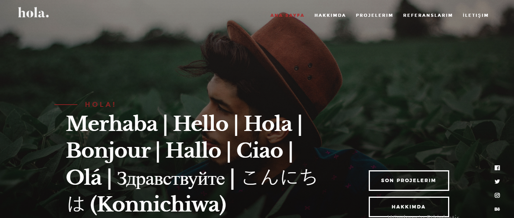
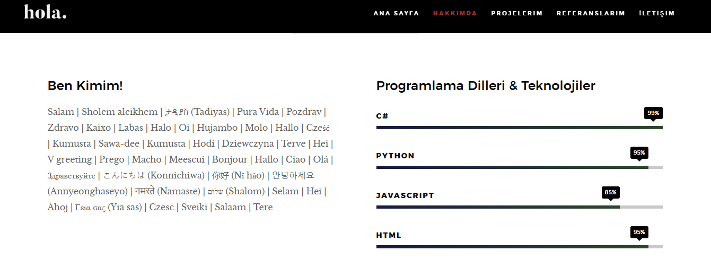
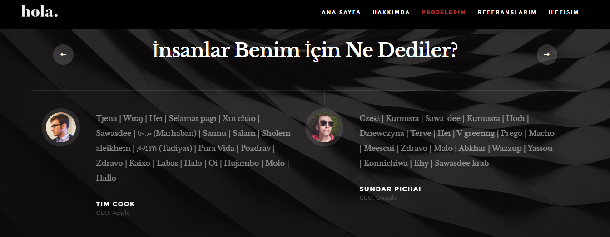
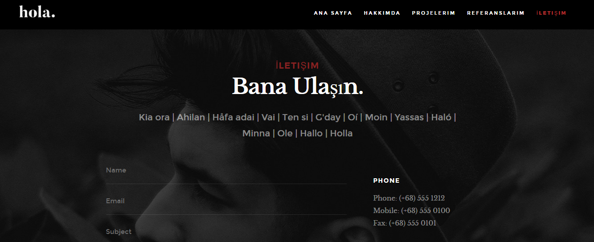

- This project aims to demonstrate how a Web Application works with C#, ASP.NET Core MVC, and MSSQL Server.

- The project is a simple portfolio website that includes a homepage, about me, projects, and contact pages.

- It is for demonstration purposes only and is developed based on what is taught in a course by Murat Yücedað.

## Technologies used in this project:
  - C#
  - ASP.NET Core MVC
  - MSSQL Server
  - Entity Framework Core
  - HTML
  - CSS
  - JavaScript

## Some views from the project:

